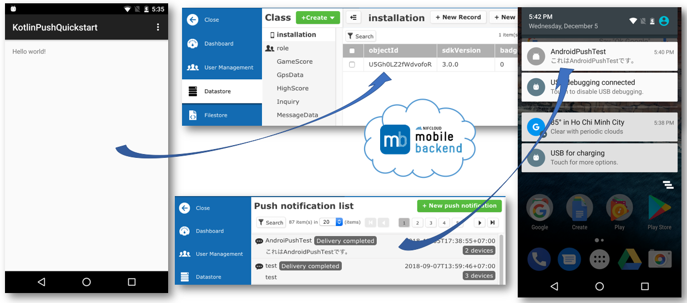
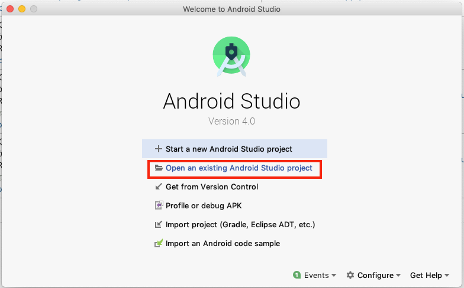
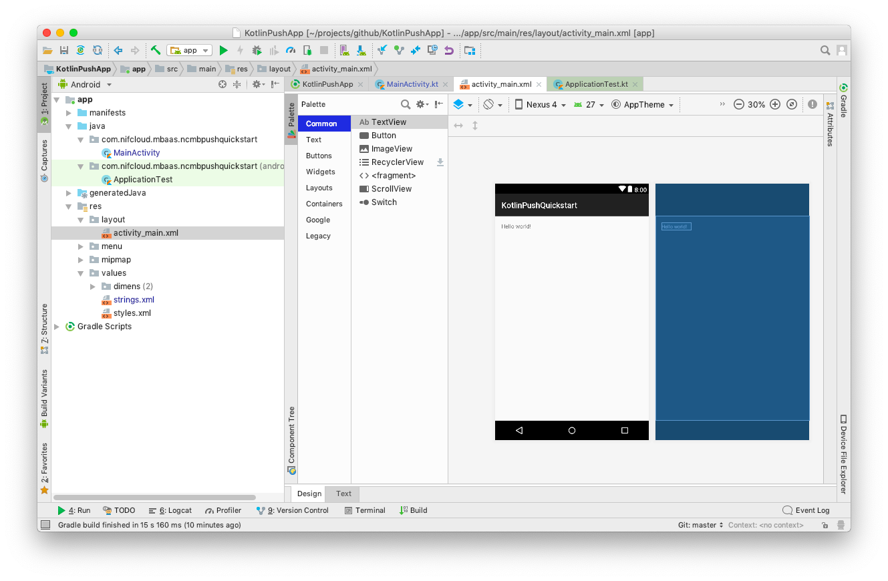
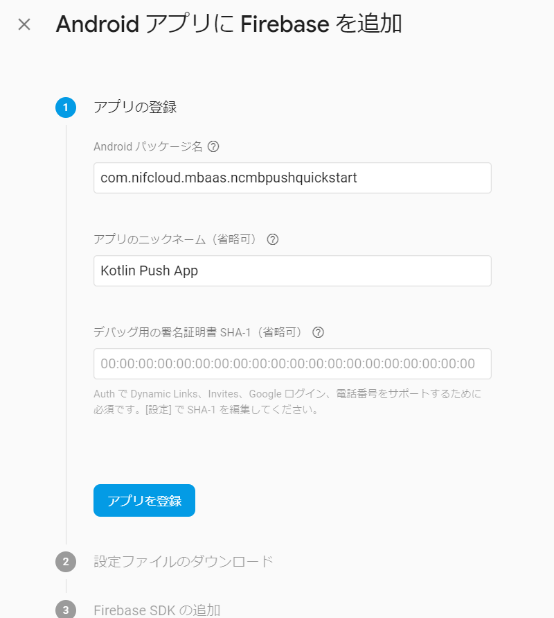
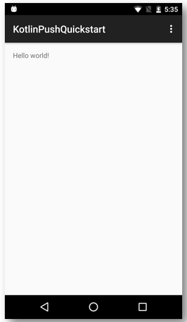
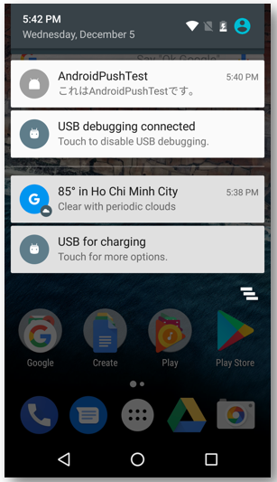
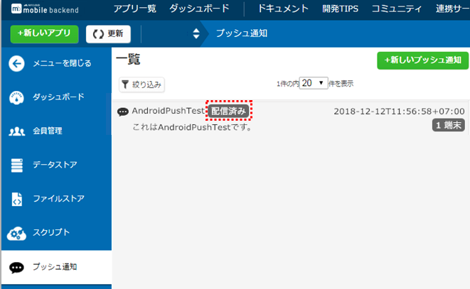

# 【Android】プッシュ通知を組み込もう！ for Kotlin
*2018/10/22作成*
<center></center>

## 概要

* [ニフクラ mobile backend](https://mbaas.nifcloud.com/) の『プッシュ通知』機能を実装したサンプルプロジェクトです
* 簡単な操作ですぐに [ニフクラ mobile backend](https://mbaas.nifcloud.com/) の機能を体験いただけます

## ニフクラ mobile backendって何？？
スマートフォンアプリのバックエンド機能（プッシュ通知・データストア・会員管理・ファイルストア・SNS連携・位置情報検索・スクリプト）が**開発不要**、しかも基本**無料**(注1)で使えるクラウドサービス！今回はデータストアを体験します

注1：詳しくは[こちら](https://mbaas.nifcloud.com/price.htm)をご覧ください

<center></center>

### ニフクラ mobile backend のプッシュ通知機能について
* Android 端末へプッシュ通知配信を行う際は、Googleが提供している Firebase Cloud Messaging（以下、FCM）と連携することで、通知の配信を行っています
- Androidアプリでプッシュ通知を受信するまでの設定は以下のような流れとなっています

    - Firebaseプロジェクトの作成とAPIキーの取得 ※APIキーの取得については2019年3月以降廃止予定
    - google-services.json とFirebase秘密鍵の設定
    - ニフクラ mobile backend での設定
    - アプリでの設定
* 詳しい設定内容は[プッシュ通知（Android）](https://mbaas.nifcloud.com/doc/current/push/basic_usage_android.html)をご参照ください

## 動作環境
* Windows 7 Professional
* Android Studio v3.1
* Android ver 4x,5x,6x,7x
* Android SDK v3
  - SDK v2系だと動作しないので注意

※このサンプルアプリは、プッシュ通知を受信する必要があるため実機ビルドが必要です<br>
※上記内容で動作確認をしています

<div style="page-break-before:always"></div>

## 手順
### 0.プッシュ通知機能を使うための準備

FCM対応したプッシュ通知を送信する場合、Firebaseプロジェクトを作成していただいたあと、下記設定を行なっていただく必要があります。
- APIキーの取得 ※2019年3月以降廃止
- google-services.jsonをアプリに配置
- Firebaseプロジェクトの秘密鍵をmobile backendにアップロード

以下のドキュメントを参考に、設定を行ってください。

__▼ Firebaseプロジェクトの作成とAPIキーの取得 ▼__<br>https://mbaas.nifcloud.com/doc/current/common/push_setup_fcm_json.html<br>
※2019年3月までの間は、Firebaseプロジェクトのサーバーキーもmobile backendにて設定していただく必要があります。

__▼ google-services.jsonとFirebase秘密鍵の設定方法について ▼__<br>https://mbaas.nifcloud.com/doc/current/common/push_setup_fcm_json.html<br>
※ [手順5.google-services.jsonの配置](https://github.com/NiFCloud-mbaas/KotlinPushApp#5-google-servicesjsonの配置) もご参考ください。

### 1. ニフクラ mobile backend の準備
* 下記リンクから会員登録（無料）をします
  * https://console.mbaas.nifcloud.com/signup
* 登録ができたら下記リンクからログインします
  * https://console.mbaas.nifcloud.com/
* 下図のように「アプリの新規作成」画面が出るのでアプリを作成します
  * 既に mobile backend を利用したことがある方は左上の「＋新しいアプリ」をクリックすると同じ画面が表示されます

<center></center>

* アプリ作成されるとAPIキー（アプリケーションキーとクライアントキー）が発行されます
* この２種類のAPIキーはこの後ダウンロードするサンプルアプリと ニフクラ mobile backend を紐付けるため、あとで使います

<center></center>

* 動作確認後、端末情報が保存される場所（データストアのinstallationクラス）を確認しておきましょう

<center></center>

<div style="page-break-before:always"></div>

* アプリ設定を開いてプッシュ通知の設定をします
   * 「プッシュ通知の許可」で「許可する」選択、「保存する」をクリックします
   * 「Androidプッシュ通知」の「APIキー」には、Firebaseでプロジェクト作成時に発行された「サーバーキー」を記入し、「保存する」をクリックします ※こちらの手順は2019年3月以降廃止予定です
   * 「FCMプッシュ通知」の「FCMプッシュ通知設定ファイルの選択」というボタンをクリックして、 Firebaseからダウンロードした __Firebaseの秘密鍵json__ ファイルをアップロードします

<center></center>

### 2. サンプルプロジェクトのダウンロード
* 下記リンクをクリックしてプロジェクトをダウンロードします
  * https://github.com/NiFCloud-mbaas/KotlinPushApp/archive/master.zip
* ダウンロードしたプロジェクトを解凍します
* AndroidStudio を開きます、「Open an existing Android Studio projct」をクリックして解凍したプロジェクトを選択します


<center></center>

<div style="page-break-before:always"></div>

* プロジェクトを開きます

<center></center>

### 3. SDKの導入（実装済み）

※このサンプルアプリには既にSDKが実装済み（下記手順）となっています。（ver.3.0.0)<br>　最新版をご利用の場合は入れ替えてご利用ください。

* SDKダウンロード
SDKはここ（[SDK リリースページ](https://github.com/NIFCloud-mbaas/ncmb_android/releases)）から取得してください.
  - NCMB.jarファイルがダウンロードします。
* SDKをインポート
  - app/libsフォルダにNCMB.jarをコピーします
* 設定追加
  - app/build.gradleファイルに以下を追加します
```gradle
dependencies {
    compile 'com.google.code.gson:gson:2.3.1'
    compile files('libs/NCMB.jar')
}
```
  - androidManifestの設定
    - <application>タグの直前に以下のpermissionを追加します
```html
<uses-permission android:name="android.permission.INTERNET" />
<uses-permission android:name="android.permission.ACCESS_NETWORK_STATE" />
```

### 4. APIキーの設定

* AndroidStudio で MainActivity.kt を開きます
  * ディレクトリはデフォルトで「Android」が選択されていますので、「Project」に切り替えてから探してください


* APIキー（アプリケーションキーとクライアントキー）の設定をします

<center></center>

* それぞれ`YOUR_APPLICATION_KEY`と`YOUR_CLIENT_KEY`の部分を書き換えます
  * このとき、ダブルクォーテーション（`"`）を消さないように注意してください！

### 5. google-services.jsonの配置

* Firebaseから発行した google-services.json をアプリに配置します
    * なお、発行時にAndroidパッケージ名は"com.nifcloud.mbaas.ncmbpushquickstart"としてください

  <center></center>

    * パッケージ名を別名にした場合はアプリ配置後、google-services.jsonファイル内の"package_name"を"mbaas.nifcloud.mbaas.ncmbpushquickstart"としてください

<center></center>

<div style="page-break-before:always"></div>

### 6. 動作確認

* AndroidStudioからビルドします
  * ビルドされたプロジェクト（apkファイル）は `\app\build\outputs\apk` に生成されます
* インストールしたアプリを起動します
  * プッシュ通知の許可を求めるアラートが出たら、必ず許可してください！

<center></center>

* 起動されたらこの時点でAndroid端末はレジスタレーションIDが取得されます
* [ニフクラ mobile backend](https://mbaas.nifcloud.com/) の管理画面から「データストア (installationクラス(端末情報))」を確認してみましょう！

<center></center>

* 端末側で起動したアプリは一度閉じておきます

<div style="page-break-before:always"></div>

### 7. プッシュ通知を送りましょう！

* いよいよです！実際にプッシュ通知を送ってみましょう！
* ニフクラ mobile backendのダッシュボードで「プッシュ通知」＞「＋新しいプッシュ通知」をクリックします
* プッシュ通知のフォームが開かれます
* 必要な項目を入力してプッシュ通知を作成します

<center></center>

* Android端末からプッシュ通知を確認しましょう！
* 少し待つとプッシュ通知が届きます！

<center></center>

* ダッシュボードからのプッシュ通知結果も確認する

<center></center>

<div style="page-break-before:always"></div>

## 解説
サンプルプロジェクトに実装済みの内容のご紹介

#### SDKのインポートと初期設定
* ニフクラ mobile backend の[ドキュメント（クイックスタート）](https://mbaas.nifcloud.com/doc/current/introduction/quickstart_android.html)をご用意していますので、ご活用ください

#### ロジック
* `activity_main.xml` でデザインを作成し、`MainActivity.kt`にロジックを書いています
*  installationクラス(端末情報)が保存される処理は SDK v3.0.0 より記述は不要となりました
  - 「APIキーの設定とSDKの初期化」のみ実装がされていれば、ニフクラ mobile backend の管理画面上でプッシュ通知の配信設定がされている場合、レジスタレーションIDの取得が自動的にされるようになっています

```kotlin
override fun onCreate(savedInstanceState: Bundle?) {
    super.onCreate(savedInstanceState)
    //**************** APIキーの設定とSDKの初期化 **********************
    NCMB.initialize(this.applicationContext, "YOUR_APPLICATION_KEY", "YOUR_CLIENT_KEY");
    setContentView(R.layout.activity_main)
}
```

## 参考
* ニフクラ mobile backend の[ドキュメント（プッシュ通知（Android）](https://mbaas.nifcloud.com/doc/current/push/basic_usage_android.html)（for Java）をご用意していますので、ご活用ください
